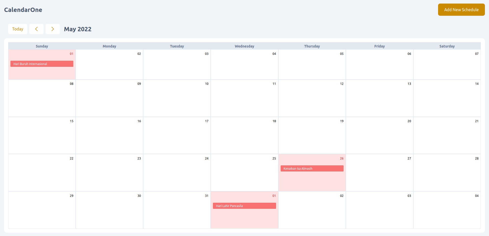
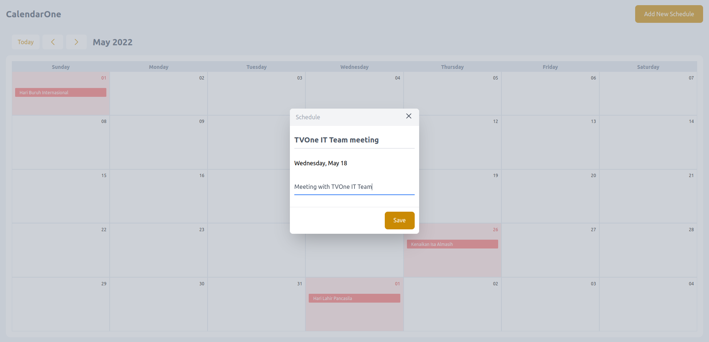
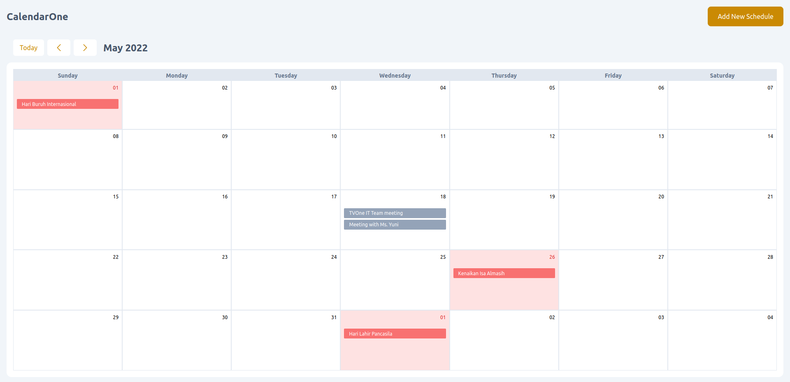

# CalendarOne
Calendar UI, Intergrated with [public holiday API](https://date.nager.at/api/v3/PublicHolidays/2022/ID) and user can Add, Edit and Remove Schedule and the data will store to localstorage, To Add Data just double click on date row and User can view Schdule detail by clcik the Schedule badge

## Overview







## TechStack


## Getting Started

First, Clone the project :

```bash
git clone https://github.com/siunixdev/calendar-one.git
```

go to project directory and install all dependencies with

```bash
npm install
```

and run the development server:

```bash
npm run dev
# or
yarn dev
```

## Demo
[Demo Here](https://bejewelled-daifuku-cebe99.netlify.app/)
